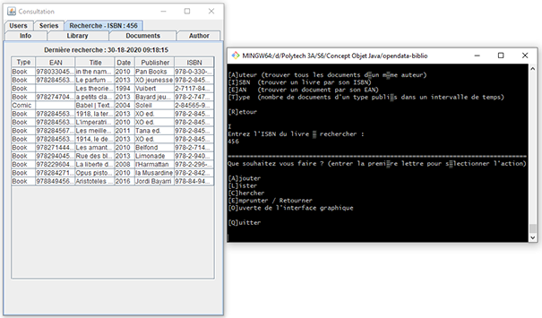

Programmation Java @ Et3
 
Polytech Paris-Saclay | 2019-20

---

# opendata-biblio

## Objectives / Asked work

[Subject link](./co-projet.pdf)

## Getting Started

These instructions will get you a copy of the project up and running on your local machine for development purpose.

### Prerequisites

Things you need to install the project :

- [Java 8 SE](https://www.java.com/fr/download/)

### Installing

Here are some instructions on how to get the development env running.

First, clone this repository with the following command :

`git clone https://github.com/adepreis/opendata-biblio`

Then create the Java project from `/src` folder using your favorite IDE.

### Run the latest version

You can find the executable .jar file in the last [release assets](https://github.com/adepreis/opendata-biblio/releases/tag/0.1).

Don't forget to give the path of the .csv when you lauch the application, for example :

`java -jar opendata-biblio.jar ./src/et3/java/data/data.csv`

---

## Documentation
You can find the project's Javadoc in the `/doc` folder and the UML class diagram in the `/uml` folder.